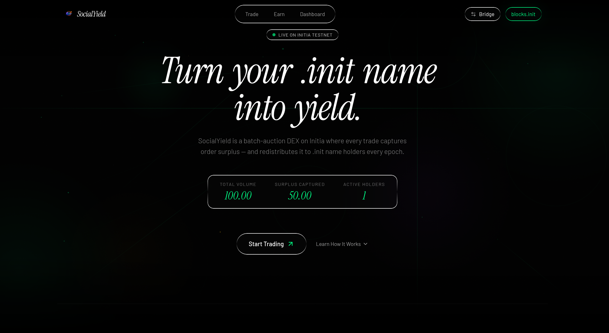
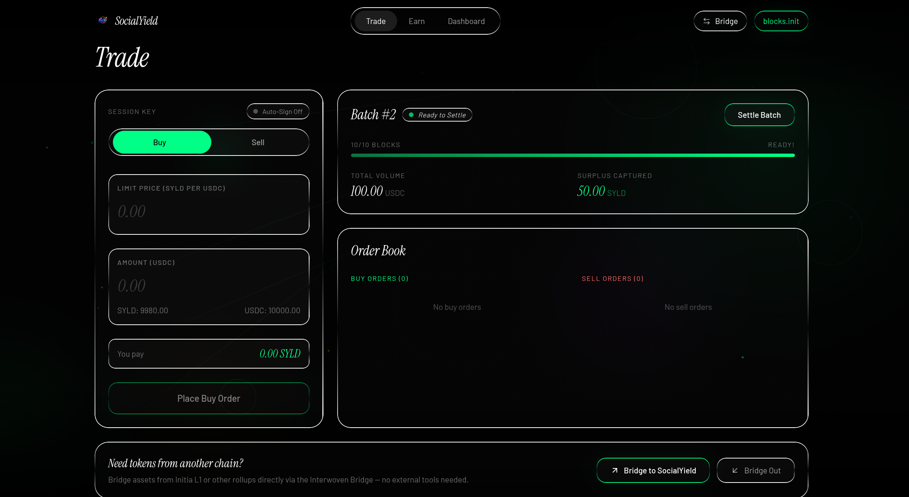
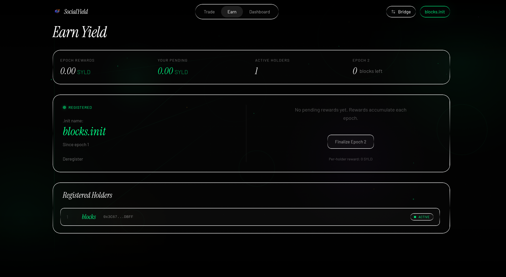
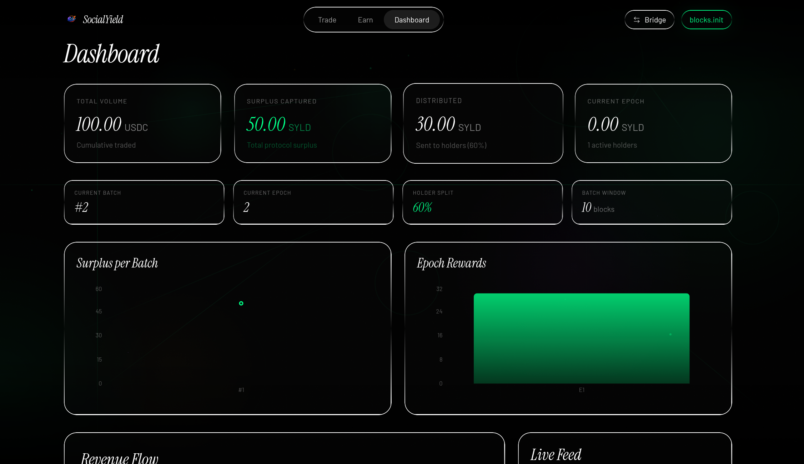
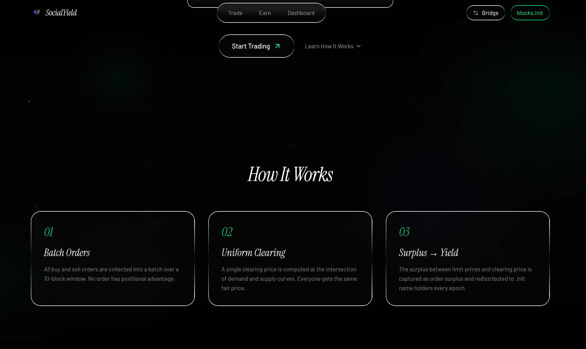

<h1 align="center">
  <br>
  SocialYield
  <br>
</h1>

<h4 align="center">A batch-auction DEX appchain on Initia that captures order surplus and redistributes it to .init name holders every epoch.</h4>

<p align="center">
  
  
  
  
  
  
</p>

---

> **SocialYield** is a sovereign Initia rollup (minievm-2) that structurally eliminates front-running through Frequent Batch Auctions. The surplus between limit prices and the uniform clearing price — value that would normally leak to MEV bots — is captured at the protocol level and distributed to registered `.init` identity holders as passive yield.

<p align="center">
  <a href="https://socialyield.vercel.app">Live App</a> · <a href="./DEMO_GUIDE.md">Testing Guide</a> · <a href="./SECURITY.md">Security Model</a> · <a href="./GTM_STRATEGY.md">GTM Strategy</a>
</p>

---

## Initia Hackathon Submission

- **Project Name**: SocialYield

### Project Overview

SocialYield is a batch-auction DEX appchain on Initia (minievm-2) that structurally eliminates MEV extraction through frequent batch auctions and redistributes the captured order surplus as passive yield to registered `.init` name holders. It solves the problem of value leakage to MEV bots — which costs DeFi traders billions annually — while giving Initia's native identity layer real economic utility. Target users are MEV-aware DeFi traders seeking fair execution, `.init` name holders looking for zero-capital passive yield, and yield farmers seeking sustainable, non-inflationary APY.

### Implementation Detail

- **The Custom Implementation**: SocialYield's core innovation is a four-contract system (BatchDEX, RevenueRouter, YieldRegistry, GovernanceTimelock) that collects orders into 10-block batch windows, computes a uniform clearing price at the demand-supply intersection, captures the surplus between trader limit prices and the clearing price, and distributes it via a 60/30/10 split (holders/DAO/dev). If a batch contains only buy orders or only sell orders, no clearing price exists — the protocol safely refunds all participants and advances to the next batch. The system includes gas safety caps (100 orders/batch, 200 epochs/claim), invariant fuzz tests proving token conservation, and a 48-hour governance timelock on all parameter changes.

- **The Native Feature**: SocialYield integrates all four Initia-native features:
  1. **Initia Usernames (`.init`)** — The core of the yield model. `.init` names are resolved from the L1 usernames module via Move view functions and serve as the identity gate for yield eligibility. Only registered `.init` holders earn surplus rewards. (`frontend/src/hooks/useInitiaUsernames.ts`)
  2. **Interwoven Kit** — Native wallet connection with automatic chain detection for minievm-2, `.init` username auto-resolution on connect, and wallet/bridge modal integration. (`frontend/src/app/providers.tsx`)
  3. **Interwoven Bridge** — Cross-chain asset bridging embedded directly in the Trade page via `openBridge()`, allowing users to move assets to/from the appchain without leaving the app. (`frontend/src/app/trade/page.tsx`)
  4. **Auto-sign / Session Keys** — Provider-level `enableAutoSign` configured for `/minievm.evm.v1.MsgCall` messages with a user-facing toggle on the Trade page, enabling frictionless multi-order placement without repeated wallet popups. (`frontend/src/app/providers.tsx`, `frontend/src/app/trade/page.tsx`)

### How to Run Locally

1. Clone the repository and install frontend dependencies:
   ```bash
   git clone https://github.com/SuyashAlphaC/SocialYield.git
   cd SocialYield/frontend && npm install
   ```
2. Copy the environment config (already configured for minievm-2 testnet):
   ```bash
   cp .env.local.example .env.local  # or use the existing .env.local
   ```
3. Start the development server:
   ```bash
   npm run dev
   ```
4. Open `http://localhost:3000`, connect a wallet with a `.init` name, and follow the [Testing Guide](./DEMO_GUIDE.md) to place orders, settle batches, register for yield, and claim rewards.

---

## Screenshots

### Landing Page
Animated hero with live protocol stats, count-up numbers, and "How It Works" explainer.

<p align="center">
  
</p>

### Trade Page
Batch-auction order form with buy/sell toggle, real-time batch progress, live order book, session key toggle, input validation, and Interwoven Bridge integration.

<p align="center">
  
</p>

### Earn Page
.init name registration flow, pending rewards display, epoch countdown, and registered holders table with live username resolution.

<p align="center">
  
</p>

### Dashboard
Protocol metrics with animated charts (Surplus per Batch, Epoch Rewards), revenue flow diagram, and multi-event live feed.

<p align="center">
  
</p>

---

## How It Works

<p align="center">
  
</p>

1. **Collect** — All buy and sell orders are gathered into a batch over a 10-block window (~5 seconds). No order has positional advantage.
2. **Clear** — A single uniform clearing price is computed at the intersection of aggregate demand and supply curves. Every filled order executes at the same price.
3. **Capture** — The difference between each trader's limit price and the clearing price (the "order surplus") is captured by the protocol instead of leaking to bots.
4. **Distribute** — Captured surplus flows through the `RevenueRouter` and is split: **60%** to registered `.init` name holders, **30%** to DAO treasury, **10%** to development.

### The Economic Flywheel

```
Trading Volume  ──>  Order Surplus Captured  ──>  Yield to .init Holders
       ^                                                    |
       |                                                    v
       +──────────  More .init Demand  <──  Higher APY  ───+
```

More trading generates more surplus. More surplus means higher yield. Higher yield drives `.init` name demand, bringing more users into the Initia ecosystem — which generates more trading volume.

---

## Features

| Feature | Description |
|---|---|
| **Frequent Batch Auctions** | Orders collected over 10-block windows, settled at a single uniform clearing price. Structurally eliminates front-running and sandwich attacks. |
| **Order Surplus Capture** | Difference between limit prices and clearing price captured as protocol revenue — not leaked to bots. |
| **Identity-Gated Yield** | Only registered `.init` name holders earn passive yield. No capital lockup, no impermanent loss. |
| **60/30/10 Revenue Split** | Automated distribution via `RevenueRouter`: 60% to holders, 30% DAO, 10% dev. |
| **Epoch-Based Distribution** | Pro-rata rewards distributed every 1000 blocks (~8 minutes). |
| **Governance Timelock** | 48-hour delay on all parameter changes with 14-day grace period. |
| **Gas Safety Caps** | `maxOrdersPerBatch` (100) prevents gas bombs. `MAX_CLAIM_EPOCHS` (200) prevents DoS on claims. |
| **Session Keys** | Auto-signing integration for one-click trading without repeated wallet popups. |
| **Interwoven Bridge** | Bridge assets to/from SocialYield directly from the Trade page. |
| **Live Dashboard** | Real-time charts, revenue flow diagram, and multi-event activity feed. |

---

## Initia-Native Integration

SocialYield integrates three Initia-native features:

| Feature | Integration | Path |
|---|---|---|
| **Initia Usernames** | `.init` names are the core of the yield model — only registered holders earn rewards. Resolution via L1 REST API. | `frontend/src/hooks/useInitiaUsernames.ts` |
| **Interwoven Bridge** | Bridge assets to/from the appchain directly from the Trade page via InterwovenKit `openBridge`. | `frontend/src/app/trade/page.tsx` |
| **Auto-Signing** | Provider configured with `enableAutoSign` for `/minievm.evm.v1.MsgCall`. Trade page exposes session key toggle. | `frontend/src/app/providers.tsx` |

**Wallet connection** handled via `@initia/interwovenkit-react` (v2.4.5) with native chain auto-configuration, `.init` detection, and bridge/wallet modals.

---

## Appchain Development & Deployment

SocialYield was developed and tested on a **local sovereign rollup** (`socialyield-1`, EVM Chain ID `1538162949916829`) spun up via the Weave CLI (`weave init`), with its own operator, validator, bridge executor, batch submitter, and challenger. This local appchain served as the development environment for iterating on the smart contracts and frontend integration before deploying to the public testnet.

For the hackathon submission, the project is deployed on **`minievm-2`** — Initia's public MiniEVM testnet rollup — so that judges and users can interact with the live contracts and verify deployment on [Initia Scan](https://scan.testnet.initia.xyz/minievm-2). The local chain configuration is preserved in `.initia/local-ids.md` and `~/.weave/data/minitia.config.json`.

### Testnet Deployment

| | |
|---|---|
| **Network** | Initia Testnet (`minievm-2`) |
| **EVM Chain ID** | `2124225178762456` |
| **Status** | Fully Operational |
| **Local Dev Chain** | `socialyield-1` (EVM Chain ID `1538162949916829`) |

### Contract Addresses

| Contract | Address |
|----------|---------|
| **BatchDEX** | [`0xbbD6525b878deB33188077B35f29B708d28B0C88`](https://scan.testnet.initia.xyz/address/0xbbD6525b878deB33188077B35f29B708d28B0C88) |
| **YieldRegistry** | [`0xc37F0d3f439FBA4E5b134271BA910ab544BE466f`](https://scan.testnet.initia.xyz/address/0xc37F0d3f439FBA4E5b134271BA910ab544BE466f) |
| **RevenueRouter** | [`0xb252F649255E4259a4853E8B55e7ddEbCe2dcD83`](https://scan.testnet.initia.xyz/address/0xb252F649255E4259a4853E8B55e7ddEbCe2dcD83) |
| **GovernanceTimelock** | [`0xC99eDAA459828ece11F72a3bD8F04bfc60fabC74`](https://scan.testnet.initia.xyz/address/0xC99eDAA459828ece11F72a3bD8F04bfc60fabC74) |
| **USDC (Test)** | [`0xA34Fa50612d20bEc3220c984135F41a806655Abd`](https://scan.testnet.initia.xyz/address/0xA34Fa50612d20bEc3220c984135F41a806655Abd) |
| **SYLD (Test)** | [`0xfDb0A9DFFDb93DA8329d5966324845213f31E328`](https://scan.testnet.initia.xyz/address/0xfDb0A9DFFDb93DA8329d5966324845213f31E328) |

### Quick Start

```
1. Visit https://socialyield.vercel.app
2. Connect wallet (Keplr / Leap)
3. Place buy/sell orders on the Trade page
4. Wait for batch settlement (10-block window)
5. Register your .init name on the Earn page
6. Claim yield after epoch finalization (~1000 blocks)
```

See [DEMO_GUIDE.md](./DEMO_GUIDE.md) for the full step-by-step walkthrough with expected results.

---

## Smart Contract Architecture

```
                    ┌───────────┐
                    │ BatchDEX  │  Collects orders, computes clearing price,
                    │ (711 LOC) │  settles batches, captures order surplus
                    └─────┬─────┘
                          │
                   surplus transfer
                          │
                    ┌─────▼─────────┐
                    │ RevenueRouter │  Splits incoming surplus:
                    │  (239 LOC)    │  60% holders / 30% DAO / 10% dev
                    └─────┬─────────┘
                          │
                    60% deposit
                          │
                    ┌─────▼─────────┐
                    │ YieldRegistry │  Epoch-based distribution to
                    │  (359 LOC)    │  registered .init holders (pro-rata)
                    └───────────────┘

                    ┌───────────────────┐
                    │ GovernanceTimelock │  48h delay on parameter changes
                    │    (202 LOC)      │  with 14-day grace period
                    └───────────────────┘
```

| Contract | Role |
|---|---|
| **`BatchDEX.sol`** | Core execution engine. Order placement, batch windows, uniform-price clearing, surplus forwarding. Gas-capped at 100 orders/batch (configurable up to 500). |
| **`RevenueRouter.sol`** | Receives surplus from BatchDEX and atomically splits across three destinations. Ratios changeable only via GovernanceTimelock. |
| **`YieldRegistry.sol`** | Maps `.init` names to wallet addresses. Pro-rata epoch rewards. Iteration capped at 200 epochs per claim. |
| **`GovernanceTimelock.sol`** | 48-hour delay on any parameter change with 14-day execution grace period. |

---

## Test Suite

45 tests across 4 test contracts. All passing.

| Test Suite | Tests | Type |
|---|---|---|
| `BatchDEXTest` | 16 | Unit |
| `YieldRegistryTest` | 17 | Unit |
| `RevenueRouterTest` | 10 | Unit + Fuzz |
| `BatchDEXInvariantTest` | 2 | Invariant Fuzz |
| **Total** | **45** | |

Includes:
- **Invariant fuzz testing** via Foundry handler — proves token conservation (no tokens created/destroyed) and accounting consistency (surplus captured = surplus routed = sum of splits) across randomized sequences of orders, settlements, and block advances.
- **Gas safety tests** — batch-full rejection, epoch claim caps, maxOrders validation.
- **Edge cases** — partial fills, zero-holder epochs, re-registration, deregistered claim eligibility.

```bash
cd contracts && forge test
```

---

## Security Model

| Protection | Mechanism |
|---|---|
| **Gas Safety** | `maxOrdersPerBatch` (100, max 500) prevents O(n^2) gas bombs. `MAX_CLAIM_EPOCHS` (200) caps reward iteration. |
| **Reentrancy** | All state-changing functions use OpenZeppelin `ReentrancyGuard`. |
| **Access Control** | Owner-gated admin functions, router-gated deposits, timelock-gated governance. |
| **Governance** | 48-hour delay with 14-day grace period on parameter changes. |
| **Mint Control** | TestToken `mint()` restricted to deployer — prevents inflation attacks. |

Full threat model and design rationale: [SECURITY.md](./SECURITY.md)

---

## Frontend Stack

| Component | Technology |
|---|---|
| Framework | Next.js 14 + Tailwind CSS |
| Wallet | `@initia/interwovenkit-react` v2.4.5 |
| Contract Interaction | Wagmi v2 + Viem |
| Charts | Recharts |
| Animations | Framer Motion + CSS keyframes |
| Design | Liquid-glass aesthetic with animated background |

**Pages**:
- **Landing** (`/`) — Hero with live stats, count-up animations, "How It Works" explainer
- **Trade** (`/trade`) — Order form, batch progress bar, order book, balance display, input validation, session key toggle, bridge CTA
- **Earn** (`/earn`) — .init registration, pending rewards, epoch countdown, holders table
- **Dashboard** (`/dashboard`) — Charts (Surplus per Batch, Epoch Rewards), revenue flow SVG, live feed with color-coded events

Fully responsive with mobile hamburger navigation.

---

## Getting Started

### Prerequisites
- [Initia Weave CLI](https://docs.initia.xyz)
- Foundry (for contract testing)
- Node.js v20+

### Appchain Deployment

```bash
# Initialize the SocialYield rollup
weave init socialyield-chain

# Deploy core contracts
sh scripts/deploy.sh
```

### Frontend

```bash
cd frontend
npm install
npm run dev
```

---

## Project Structure

```
socialyield/
  .initia/
    submission.json              # Hackathon submission metadata
  contracts/
    src/
      BatchDEX.sol               # Batch-auction DEX with surplus capture
      YieldRegistry.sol          # Epoch-based yield distribution
      RevenueRouter.sol          # 60/30/10 surplus split
      GovernanceTimelock.sol     # 48h parameter change delay
      TestToken.sol              # Owner-gated ERC20 for testnet
    test/
      BatchDEX.t.sol             # 16 unit tests
      BatchDEX.invariant.t.sol   # 2 invariant fuzz tests
      YieldRegistry.t.sol        # 17 unit tests
      RevenueRouter.t.sol        # 10 unit + fuzz tests
    script/
      Deploy.s.sol               # Foundry deployment script
  frontend/
    src/
      app/                       # Next.js pages (trade, earn, dashboard)
      components/                # Navbar, TransactionStatus, CountUp, etc.
      hooks/                     # useBatchDEX, useYieldRegistry, useInitiaUsernames
      lib/                       # Contract ABIs and addresses
  docs/
    screenshots/                 # UI screenshots
  DEMO_GUIDE.md                  # Step-by-step testing guide for judges
  SECURITY.md                    # Threat model and security design
  GTM_STRATEGY.md                # Go-to-market strategy and projections
```

---

## Why SocialYield

| | |
|---|---|
| **Appchain as a Business** | Directly utilizes Initia's "keep the revenue" model. Every batch settlement generates protocol revenue that stays in-house. |
| **Structural Solution** | Front-running eliminated at the execution layer through batch auctions — not patched with private mempools. |
| **Identity-Driven Flywheel** | Tying yield to `.init` names creates organic demand for Initia's identity layer. More registrations = more ecosystem growth. |
| **Zero-Capital Yield** | Unlike LP-based yield, `.init` holders earn passive income without depositing tokens, without impermanent loss, without risk. |

---

<p align="center">
  <em>Build the app. Keep the revenue. Share it with the community.</em>
  <br>
  <strong>SocialYield — Powered by Initia</strong>
</p>
